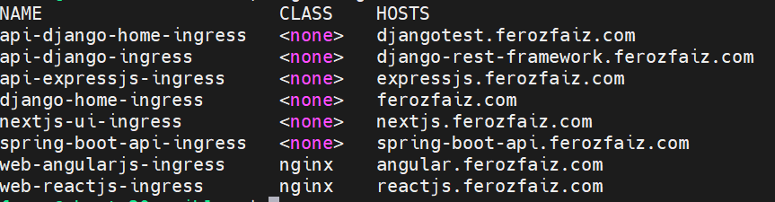

# Next.js UI

## About the Project

This is a modern Next.js UI application designed to interface with a Spring Boot API for product data, utilizing the Entity-Attribute-Value (EAV) model. The UI is built with TypeScript, Tailwind CSS, and leverages a modular monorepo structure. Authentication and authorization are implemented using a custom solution, and several in-house packages are integrated for enhanced security, CSRF protection, middleware chaining, and form building. The application is deployed on a self-managed Kubernetes cluster for scalability and reliability.

**Live Demo:** <a href='https://nextjs.ferozfaiz.com' target='_blank'>nextjs.ferozfaiz.com</a>

## Features

- **Next.js 15 (App Router)**: Server-side rendering, static site generation, and API routes
- **TypeScript**: Type-safe development
- **Tailwind CSS**: Utility-first styling
- **Custom Authentication & Authorization**: Secure login and access control
- **Product Data via Spring Boot API**: Fetches products using EAV model
- **Internationalization (i18n)**: Multi-language support
- **Reusable UI Components**: Built with Storybook
- **Docker & Kubernetes Ready**: Containerized and deployable
- **Custom Middleware**: Flexible request/response processing

## Custom Packages Used

- [`@nartix/edge-token`](https://www.npmjs.com/package/@nartix/edge-token) (`@nartix/edge-token`): Edge token utilities for secure API access
- [`@nartix/next-csrf`](https://www.npmjs.com/package/@nartix/next-csrf) (`@nartix/next-csrf`): CSRF protection middleware for Next.js
- [`@nartix/next-middleware-chain`](https://www.npmjs.com/package/@nartix/next-middleware-chain) (`@nartix/next-middleware-chain`): Middleware chaining for Next.js
- [`@nartix/next-security`](./packages/next-security): Security headers and best practices
- [`@nartix/mantine-form-builder`](./packages/mantine-form-builder): Dynamic form builder using Mantine UI

## Key Dependencies

- **Next.js 15**
- **Tailwind CSS**
- **Mantine UI**
- **Storybook**: Component development and documentation
- **PNPM**: Fast, disk-efficient package manager
- **TurboRepo**: Monorepo build system

## API Integration

- **Spring Boot API**: Consumes a secure REST API for product data, which uses the EAV model and is protected by OpenID Connect and Vault.
- **Next.js UI**: Connects securely to the API using OpenID Connect for authentication and authorization.
- **Live API Demo**: <a href='https://spring-boot-api.ferozfaiz.com/swagger-ui.html' target='_blank'>spring-boot-api.ferozfaiz.com</a>

## Kubernetes

